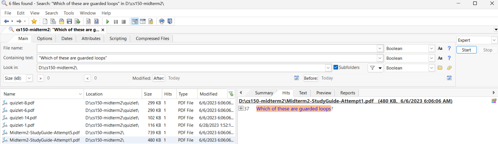

# cs150-midterm2
Midterm 2 - Prototype for flash cards. Multiple imperfect attempts.
See quizlet sources which contain answers for several of the questions.

## Google Drive Link
https://drive.google.com/drive/folders/1HR7O-9s13dyQ0NqVU3SldeKe4lMUQdVB?usp=drive_link

## Github Link
https://github.com/gogocplusplus/cs150-midterm2

## Github command
`git clone https://github.com/gogocplusplus/cs150-midterm2.git`

## Optional search tool - free (for Windows)
### Agent Ransack / Filelocator Lite
https://www.mythicsoft.com/
or
https://www.mythicsoft.com/agentransack/

## Example of using free optional search tool
